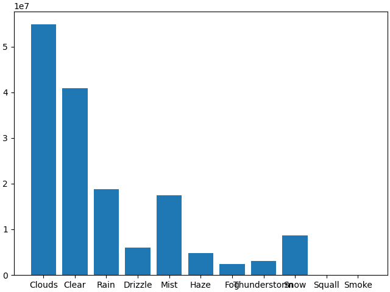
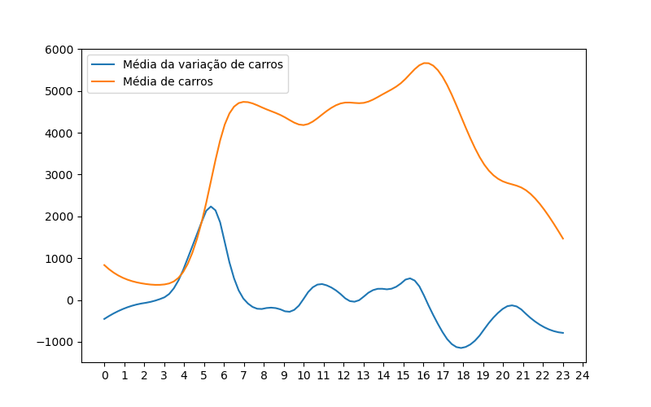
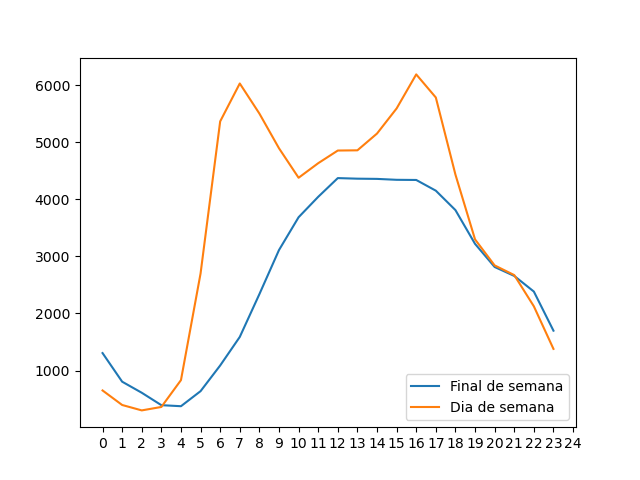
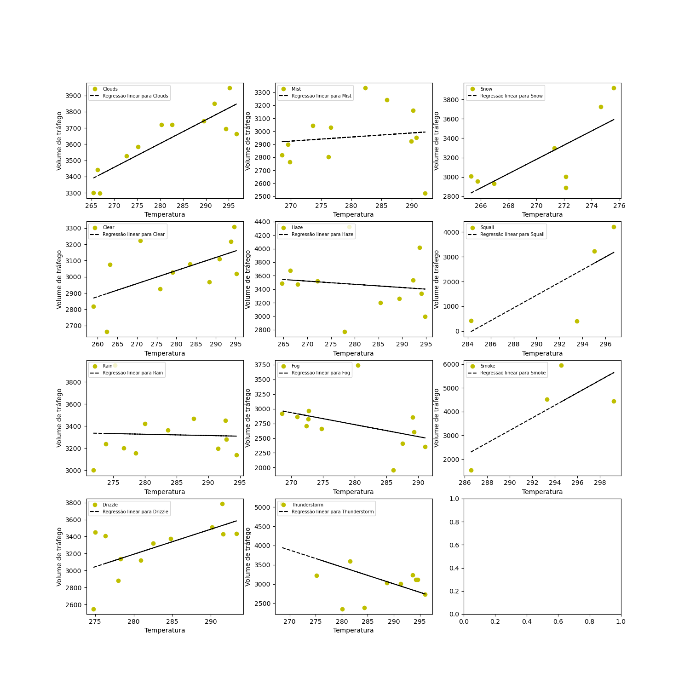

# I-94 Traffic Analysis Project

This project was created with the objective of analyzing traffic data from the interstate highway that connects **Minneapolis and St. Paul, Minnesota**, known as **I-94**.

Dataset used in this project:  
https://archive.ics.uci.edu/dataset/492/metro+interstate+traffic+volume

## Project Goal

The goal of this project is to analyze and present traffic information such as:

- The difference in traffic between **weekends and business days**
- **Daily traffic trends and evolution**
- Indicators showing **when traffic is most intense** on the highway and **how significant those peaks are**

## Dataset

The main dataset used in this project is the file:

`Metro_Interstate_Traffic_Volume.csv`

## Project Structure

The project is organized as follows:

Dados_csv/
Metro_Interstate_Traffic_Volume.csv

scripts/
analise.ipynb
analise.py
atualizacao_csv.py

imagens/
images files used in README.

### Folder and Files Description

**Dados_csv/**  
Contains the datasets used in the project.

**analise.ipynb**  
A **Jupyter Notebook** containing all traffic analyses performed on the dataset  
`Metro_Interstate_Traffic_Volume.csv`, including explanations and conclusions for each indicator.

**analise.py**  
The same analysis contained in `analise.ipynb`, but exported to a **Python (.py) script**.  
This allows the analysis to be executed directly from a terminal using **Python 3**.

**atualizacao_csv.py**  
An auxiliary script that updates the file `Metro_Interstate_Traffic_Volume.csv` by generating **synthetic data based on the original dataset values**.

## Dataset Structure

The file **Metro_Interstate_Traffic_Volume.csv** is organized as follows:

## Dataset Structure

The dataset **Metro_Interstate_Traffic_Volume.csv** contains the following fields:

| Column | Type | Description |
|------|------|-------------|
| holiday | string | Holiday indicator |
| temp | float | Temperature |
| rain_1h | float | Rain amount (mm) |
| snow_1h | float | Snow amount (mm) |
| clouds_all | int | Cloud coverage (%) |
| weather_main | string | General weather condition |
| weather_description | string | Detailed weather description |
| date_time | string | Date and time of the record (YY-MM-DD HH-MM-SS) |
| traffic_volume | int | Number of vehicles recorded |

---

# Data Analysis

The file **`analise.ipynb`** contains all analyses performed on the dataset.

The analysis was developed using:

- **pandas**
- **matplotlib**

The notebook reflects the author's **learning curve**, experimenting with different methods to achieve the same analytical results and visualizations.

Below are some examples of the results obtained.

---

## Traffic Volume by Weather Condition

The graphs above show the **average traffic volume**, along with the **maximum and minimum values** for each weather condition.

Some notable observations:

- Average traffic decreases by approximately:
  - **19% during fog**
  - **38% during squalls**
  - **12% during mist**

These values are compared to the average traffic on **cloudy and clear days**.

This indicates a **clear reduction in traffic flow during adverse weather conditions**, suggesting that drivers tend to avoid traveling under these circumstances.

The second graph reveals that although fog, squalls, and mist have lower **average traffic**, the **highest maximum traffic values** were observed during **smoke and squall conditions**.

This may indicate that **smoke conditions can significantly impact driver behavior depending on intensity**, even though their average traffic remains comparable to sunny days.

Among all weather types, **squall conditions appear to be the most avoided**, presenting both the **lowest average traffic** and the **lowest maximum vehicle count**.

---

## Hourly Traffic Evolution

The first graph represents the **average hourly traffic volume**, with vertical bars indicating the **standard deviation** of the data.

Key observations:

- The first traffic peak occurs between **06:00 and 07:00**.
- This period also shows the **largest dispersion (high standard deviation)**.

This suggests that **morning rush hour is less predictable** than the afternoon rush hour, being more sensitive to external factors such as accidents, holidays, or unexpected events.

This variability is not observed during periods such as:

- **00:00 – 04:00**
- **09:00 – 14:00**

During these hours, traffic remains more stable.

The **highest traffic volume** occurs at the end of the workday, between **16:00 and 17:00**, although with **less dispersion** than the morning peak.

The second image compares the average traffic volume in weekdays (blue curve) and the rate of change of the traffic volume (yellow) per hour. It was made by 
interpolating the mean traffic volume and taking the first derivative of it. It shows that the peek in the morning between **06:00 and 07:00**, it's caused by
a rapdly increase in of the amount of cars from 5:00, which could point out that the traffic in the cities are high in early hours than in the highway.
Around 7 a.m., the number of cars stabilizes, as indicated by the blue function near 0 in the graph above. After 4 p.m., the variation in the number of cars 
becomes negative, meaning that more cars are leaving the highway than entering it, indicating a possible traffic jam on the roads of the cities connected to the highway.

---

## Traffic Evolution: Weekdays vs Weekends

This analysis shows the **average traffic evolution throughout the day** for different types of days.

There is a clear difference between **weekdays and weekends**:

- Weekends do not present sharp traffic peaks like weekdays.
- This reflects the lower overall traffic volume on weekends.

Additional observations:

- Traffic tends to increase later in the day on weekends.
- The growth in traffic is more gradual, reducing the probability of congestion.
- The highest weekend traffic volume occurs between **11:00 and 16:00**, remaining relatively stable during this period.

This likely reflects different travel habits on weekends, where people travel later compared to workdays.

In most hours, weekday traffic is higher, except for:

- **t > 21h**
- **t < 3h**

This likely corresponds to people staying out later in other cities during weekends.

---

## Correlation Between Temperature and Traffic Volume

This analysis explores the **correlation between temperature and traffic volume under different weather conditions**.

Some weather conditions show stronger correlations, such as:

- **snow**
- **cloudy conditions**

Other conditions show very weak correlations, such as:

- **rain**
- **clear days**

The **yellow points** in the graph represent **monthly averages**.

For additional analyses and visualizations, refer to:

analise.ipynb

---

# Automatic Dataset Update

The script **`atualizacao_csv.py`** was created to automate updates to the dataset **Metro_Interstate_Traffic_Volume.csv**.

Its purpose is to simulate **daily data updates**, enabling continuous analysis of traffic patterns.

Because real-time traffic data is not easily accessible, the script generates **synthetic data based on the statistical distribution of the original dataset**.

The generated values generally follow the formula:

MEAN + STANDARD_DEVIATION * RANDOM_NUMBER + NOISE

Where:

- **RANDOM_NUMBER** ranges from **-1 to 1**
- **NOISE** introduces additional variability to simulate real-world fluctuations

The noise component is generated using squared random values, ensuring that the noise is generally small but still present.

---

## Automation with Cron

This script can be automated in Linux using:
crontab -e

This allows the system to execute the script **daily or at predefined intervals**, enabling the dataset to be continuously updated and analyzed.crontab -ecute os códigos diariamente ou em periodos pré-estabelecidos.
